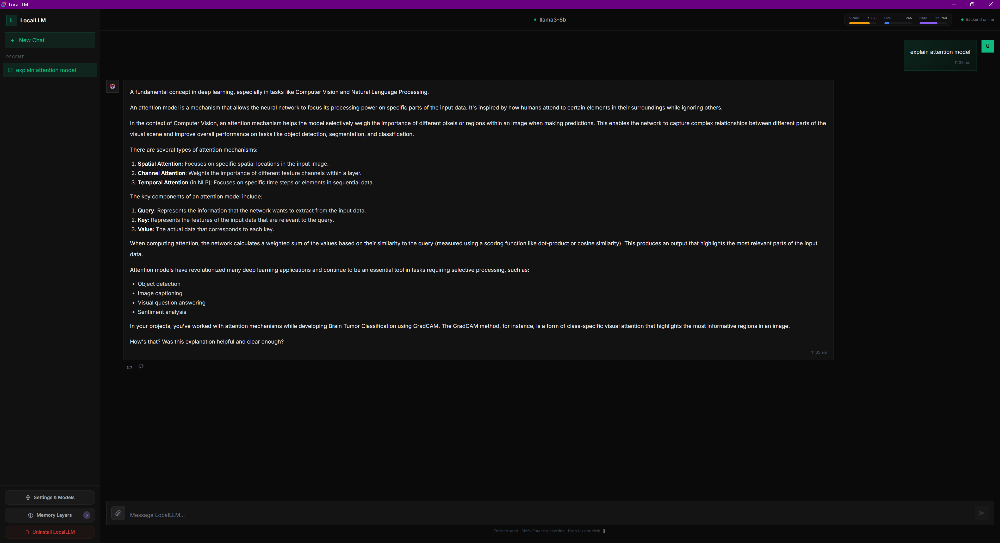
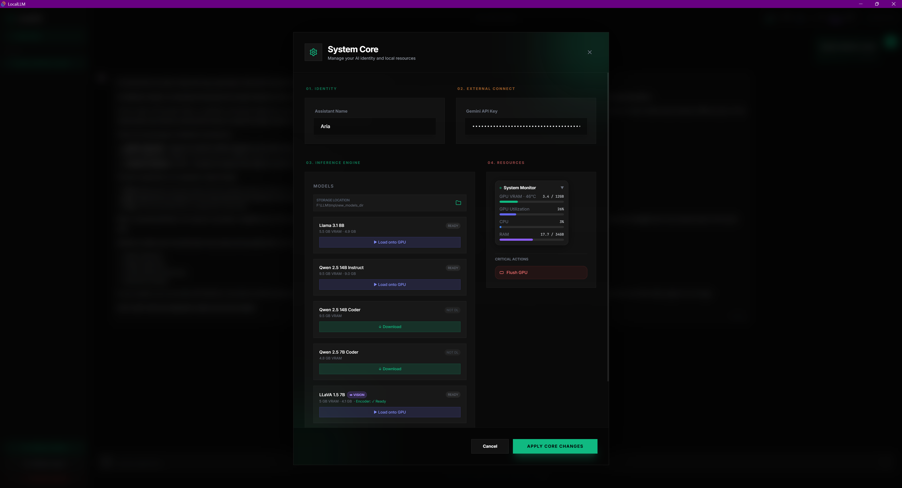

# LocalLLM — Private AI on your GPU

A full-stack desktop AI chat application powered by:
- **Tauri 2** (Rust backend / desktop shell)
- **React + Vite + TailwindCSS** (frontend)
- **Python FastAPI + llama-cpp-python** (GPU inference)
- **CUDA / cuBLAS** (RTX 3060 12GB GPU acceleration)



> **Modern Aesthetic**: A premium, glassmorphic interface designed for clarity and speed. The UI provides a distraction-free environment for interacting with local LLMs, complete with real-time performance monitoring in the top-left corner.

---

## Quick Start

### Step 1 — Prerequisites (install once)

| Tool | Version |
|------|---------|
| [Node.js](https://nodejs.org) | 18+ |
| [Python](https://python.org) | 3.10+ |
| [Rust](https://rustup.rs) | stable + MSVC toolchain |
| [CUDA Toolkit](https://developer.nvidia.com/cuda-downloads) | 12.x |
| Visual Studio Build Tools | "Desktop development with C++" |

### Step 2 — Run setup (first time only)

```bat
setup.bat
```

This installs:
- Python requirements (`fastapi`, `uvicorn`, `psutil`, `httpx`, etc.)
- `llama-cpp-python` with CUDA wheel (cu121 by default — change in `setup.bat` line ~34 if your CUDA is 12.2/12.4)
- npm dependencies

### Step 3 — Launch

```bat
start.bat
```

This:
1. Kills any old instances on ports 8000 / 1420
2. Starts Python backend (`uvicorn main:app --port 8000`) in background
3. Launches Tauri dev mode (compiles Rust on **first run only**, ~5-10 min)

---

## Architecture

```
┌─────────────────────────────────┐
│   Tauri Window (WebView2)        │
│                                  │
│  ┌──────────┬─────────┬───────┐ │
│  │ Sidebar  │  Chat   │ Panel │ │
│  │ (convs)  │ Window  │(model)│ │
│  └──────────┴─────────┴───────┘ │
│                                  │
│  SystemMonitor ←── Rust/NVML    │
└──────────────┬──────────────────┘
               │ HTTP/SSE
               ▼
┌─────────────────────────────────┐
│   Python FastAPI (port 8000)     │
│                                  │
│   /generate     (SSE stream)     │
│   /load_model   (GPU offload)    │
│   /unload_model (free VRAM)      │
│   /download_model (SSE progress) │
│   /status                        │
│   /system_stats                  │
└──────────────┬──────────────────┘
               │ llama-cpp-python
               ▼
┌─────────────────────────────────┐
│   GGUF Model on RTX 3060        │
│   (CUDA / cuBLAS layer offload) │
└─────────────────────────────────┘
```

---

## CUDA Wheel Version

By default `setup.bat` installs the **cu121** wheel. If your CUDA is different:

```bat
# In setup.bat, change this line:
pip install llama-cpp-python --extra-index-url https://abetlen.github.io/llama-cpp-python/whl/cu121

# To (for CUDA 12.4):
pip install llama-cpp-python --extra-index-url https://abetlen.github.io/llama-cpp-python/whl/cu124
```

---

## Models

| Model | VRAM | Notes |
|-------|------|-------|
| Llama 3.2 1B | ~1.1 GB | Fastest, good for quick tasks |
| Qwen 2.5 7B Coder | ~4.8 GB | Best for coding |
| Llama 3.1 8B | ~5.5 GB | Best general purpose |

All models are downloaded on-demand from HuggingFace into `./models/`.

---

## Project Structure

```
F:\LLM\
├── backend/
│   ├── main.py            ← FastAPI app (all routes)
│   ├── model_manager.py   ← Singleton GPU model manager
│   └── requirements.txt
├── frontend/ (inside src/)
│   ├── components/
│   │   ├── ChatWindow.tsx      ← Streaming chat interface
│   │   ├── MessageBubble.tsx   ← Markdown + code + LaTeX renderer
│   │   ├── CodeBlock.tsx       ← Syntax highlight + copy
│   │   ├── LatexRenderer.tsx   ← KaTeX inline/block + toggle
│   │   ├── Sidebar.tsx         ← Conversation management
│   │   ├── ModelPanel.tsx      ← Download/load/switch models
│   │   ├── SystemMonitor.tsx   ← GPU/CPU/RAM live stats
│   │   └── FlushButton.tsx     ← VRAM flush
│   ├── store/
│   │   ├── chatStore.ts        ← Zustand multi-chat
│   │   └── modelStore.ts       ← Zustand model state
│   └── lib/
│       └── api.ts              ← SSE + REST client
├── src-tauri/
│   ├── src/
│   │   ├── lib.rs              ← Tauri entry + command registry
│   │   ├── main.rs             ← Binary entry
│   │   └── system_monitor.rs  ← NVML GPU + sysinfo CPU/RAM
│   ├── Cargo.toml              ← Rust deps (nvml-wrapper, sysinfo)
│   └── tauri.conf.json         ← Window + CSP config
├── models/                     ← GGUF files stored here
├── start.bat                   ← Single-command launcher
├── setup.bat                   ← One-time dependency installer
└── README.md
```

---

## Build Production .exe

```bat
npm run tauri build
# Output: src-tauri\target\release\LocalLLM.exe
```

---


## Features

- ✅ **ChatGPT-quality UI** — dark theme, glassmorphism, smooth animations
- ✅ **Streaming responses** — token-by-token via SSE
- ✅ **Code highlighting** — Prism.js with copy button + "Copied ✓" feedback
- ✅ **LaTeX rendering** — KaTeX inline (`$...$`) / block (`$$...$$`) + raw toggle
- ✅ **Multi-chat** — create, rename, delete conversations, localStorage persistence
- ✅ **Model management** — download with speed/progress bar, GPU load/unload
- ✅ **System Monitor** — VRAM / GPU util / CPU / RAM live bars (top-left)
- ✅ **Flush GPU** — single button to kill model and clear VRAM
- ✅ **Full CUDA offload** — all 99 layers on GPU for RTX 3060 12GB
- ✅ **Safe model switching** — previous model fully unloaded before new load
